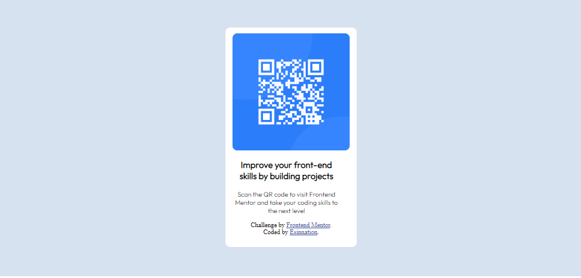

# Frontend Mentor - QR code component solution

This is a solution to the [QR code component challenge on Frontend Mentor](https://www.frontendmentor.io/challenges/qr-code-component-iux_sIO_H). Frontend Mentor challenges help you improve your coding skills by building realistic projects. 

## Table of contents

- [Overview](#overview)
  - [Screenshot](#screenshot)
  - [Links](#links)
- [My process](#my-process)
  - [Built with](#built-with)
  - [What I learned](#what-i-learned)
  - [Continued development](#continued-development)
  - [Useful resources](#useful-resources)
- [Author](#author)


## Overview

### Screenshot



### Links

- Solution URL: [Add solution URL here](https://your-solution-url.com)
- Live Site URL: [Add live site URL here](https://your-live-site-url.com)

## My process

### Built with

- Semantic HTML5 markup
- CSS custom properties
- Flexbox


### What I learned


```html
 <div class="background">
    <div class="container">
      <div class="image-container"></div>
      <div class="text-container"> <div class="text">
```      
```css
body,.background,.container,.image-container,.text-container{    
    display: flex;
    justify-content: center;
}
```

### Continued development

In my future projects i would probably focus more Javascript and CSS cause i need to work on my css 

### Useful resources
- [Resource](https://www.w3schools.com) - This is an amazing website that helped me when i had problems remembering some css properties. I'd recommend it to anyone still learning this concept and anyone who need a quick recap on any concept.


## Author

- Github - [Esinnation](https://www.github.com/esinnation)
- Frontend Mentor - [@Esinnation](https://www.frontendmentor.io/profile/Esinnation)
- Twitter - [@Esinnation](https://www.twitter.com/esinnation)


